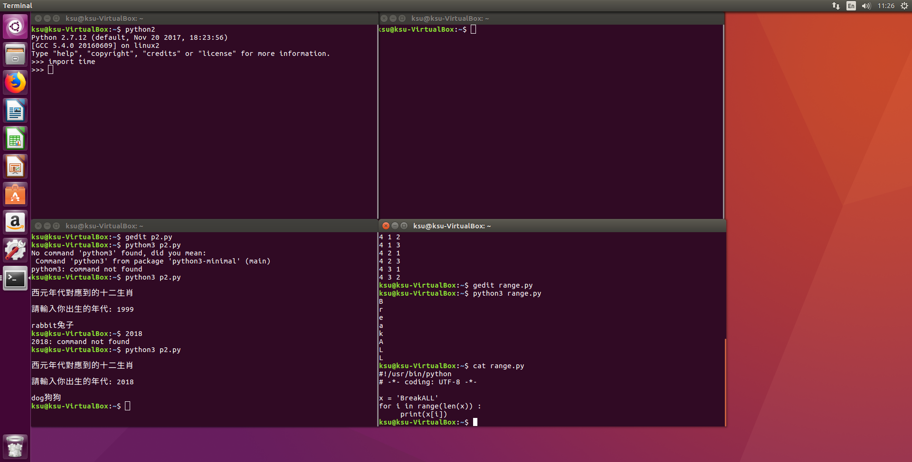

# For loop 
# time
```
import time
date = time.localtime()		#取得目前的日期時間
year = date[0]
month = date[1]
day = date[2]
day_month = [31, 28, 31, 30, 31, 30, 31, 31, 30, 31, 30, 31]
if year%400==0 or (year%4==0 and year%100!=0):	#判斷是否為閏年
    day_month[1] = 29
if month==1:
    print(day)
else:
    print(sum(day_month[:month-1])+day)

```
# zodiac
```
#!/usr/bin/python
#-*- coding: UTF-8 -*-          # print chinese
print("")
print("西元年代對應到的十二生肖")
print("")
year = eval(input("請輸入你出生的年代: "))
print("")
zodiacYear = year % 12 
if zodiacYear == 0:
    print("monkey===猴子哩")
elif zodiacYear == 1:
    print("rooster雞")
elif zodiacYear == 2:
    print("dog狗狗")
elif zodiacYear == 3:
    print("pig豬豬")
elif zodiacYear == 4: 
    print("rat鼠")
elif zodiacYear == 5: 
    print("ox牛")
elif zodiacYear == 6:
    print("tiger虎虎生威")
elif zodiacYear == 7:
    print("rabbit兔子")
elif zodiacYear == 8:
    print("dragon偉大的龍")
elif zodiacYear == 9:
    print("snake蛇")
elif zodiacYear == 10:
    print("horse馬")
else: 
    print("sheep羊")

```
# ???

```
#!/usr/bin/python
# -*- coding: UTF-8 -*- 
 
for i in range(1,5):            # range(1,5)=1~4
    for j in range(1,5):
        for k in range(1,5):
            if( i != k ) and (i != j) and (j != k):
                print (i,j,k)
               
```
# Narcisstic Number(3 digits)

```

for i in range(100, 1000):
	ge =  i % 10
	shi = i // 10 % 10   
	bai = i // 100
	if ge**3+shi**3+bai**3 == i:
		print(i)

```
# while loop 
# 猜數字游戲
```

#猜數字游戲_版本二:Python3
#!/usr/bin/env python
#coding=utf-8

from __future__ import print_function #可有可無

import random
x = random.randint(1,100)

while (1):   # frequent used
   number = int(input("猜數字，輸入一個數字:"))
   if x == number:
      print("您猜對了!")
      print(“獎品是 BreakALL{you have done a good guess}")
      break     # a must have, else infinit
   elif x > number:
      print("比",number,"大")
   elif x < number:
      print("比",number,"小")

```
# integer
```

#!/usr/bin/python
# -*- coding: UTF-8 -*-

numbers = []
while True:
    x = input('請輸入一個整數：')
    try:						#異常處理結構的相關細節，詳見第7章
        numbers.append(int(x))
    except:
        print('不是整數')
    while True:
        flag = input('繼續輸入嗎？（yes/no）')
        if flag.lower() not in ('yes', 'no'):	#限定輸入的內容必須為yes或no
            print('只能輸入yes或no')
        else:
            break
    if flag.lower()=='no':
        break

print(sum(numbers)/len(numbers))

```
# Range



# print "BREAKALL"
```

#!/usr/bin/python
# -*- coding: UTF-8 -*-

x = 'BreakALL'
for i in range(len(x)) :
     print(x[i])
# "cat XXX.py" means to print the code out 
```
# 1~100 sum
```

#!/usr/bin/python
# -*- coding: UTF-8 -*-
 
tmp = 0
for i in range(1,101):
    tmp += i
print ('The sum is %d' % tmp)

```

```
